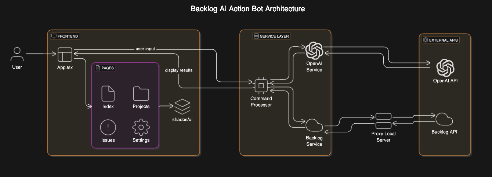

# Backlog AI Action Bot

An AI-powered application that allows you to interact with your Backlog instance using natural language commands.

## Project Overview

Backlog AI Action Bot translates natural language commands into Backlog API calls, enabling you to manage your projects, issues, wikis, and more through simple conversational inputs. The application uses OpenAI's language models to interpret your commands and execute the appropriate Backlog API requests.

## Features

- **Natural Language Command Processing**: Control Backlog with simple English commands
- **Comprehensive API Support**: Access all major Backlog API endpoints including:
  - Space management
  - Projects management
  - Issues tracking
  - User management
  - Wiki pages
  - Milestones/Versions
  - Categories
  - Issue types
  - Custom fields

## Architecture

Below is the architecture diagram for the Backlog AI Action Bot:



## Getting Started

### Prerequisites

To use this application, you'll need:
1. A Backlog account with API access
2. An OpenAI API key

### Installation

Clone the repository and install dependencies:

```sh
# Clone the repository
git clone https://github.com/banoth-ravinder/backlog-ai-bot.git
cd backlog-ai-bot

# Install dependencies
npm install
```

### Running the Proxy Server

The application uses a proxy server to handle requests to the Backlog API. Start the proxy server before running the web app:

1. Navigate to the project directory:
   ```sh
   cd backlog-ai-bot
   ```

2. Start the proxy server:
   ```sh
   node proxy-server.js
   ```

   The proxy server will run on `http://localhost:3001`.

### Running the Web App

After starting the proxy server, you can run the web app:

```sh
# Start the development server
npm run dev
```

The web app will run on `http://localhost:8080` (or another port if specified).

### Environment Configuration

This application uses environment variables to securely store API credentials. Create a `.env` file in the root directory with the following variables:

```
# Backlog API Configuration
VITE_BACKLOG_API_KEY=your_backlog_api_key_here
VITE_BACKLOG_SPACE_ID=your_space_id_here

# OpenAI API Configuration
VITE_OPENAI_API_KEY=your_openai_api_key_here
```

**Note:** The environment variables are prefixed with `VITE_` to make them accessible in the client-side code.

### Using the Application

1. Set up your environment variables in the `.env` file as described above.
2. Go to the home page.
3. Type natural language commands in the input field, for example:
   - "Show me all my projects"
   - "Create a new issue titled 'Fix login bug' in project ABC"
   - "List all open issues assigned to me"
   - "Get details about wiki page 123"

The application will interpret your command and execute the corresponding Backlog API call.

## Testing

The application uses Vitest for unit and integration testing. To run the tests:

```sh
# Run tests once
npm run test
```

#### Test Structure

- `src/test/setup.ts`: Global test setup, including MSW server configuration for API mocking
- Unit tests are located next to the files they test with a `.test.ts` or `.test.tsx` extension
- MSW is used to mock API responses from Backlog and OpenAI

## Available Commands

The application supports a wide range of commands for interacting with Backlog:

- **Space Commands**:
  - Get space information
  - Get space activities
  - Get/update space notifications

- **Project Commands**:
  - List all projects
  - Get project details
  - Create/update/delete projects

- **Issue Commands**:
  - List issues
  - Get issue details
  - Create/update/delete issues
  - Get/add comments to issues

- **User Commands**:
  - List all users
  - Get user details
  - Get user activities

- **Wiki Commands**:
  - List wikis
  - Get/create/update/delete wiki pages
  - Get wiki tags

- **Milestone/Version Commands**:
  - List/create/update/delete milestones

- **Category Commands**:
  - List/create/update/delete categories

- **Issue Type Commands**:
  - List/create/update/delete issue types

- **Custom Field Commands**:
  - List/create/update/delete custom fields

## Technology Stack

- React + TypeScript
- Vite
- Tailwind CSS
- shadcn/ui components
- OpenAI API for natural language processing
- Backlog API for project management integration

## Development

This project uses:
- React Router for navigation
- TanStack Query for data fetching
- Tailwind CSS for styling
- shadcn/ui for UI components


## Future works
- Enhanced Natural Language Understanding like Context Awareness, Customizable Prompts, Multi-Language Support.
- Performance Optimization like Caching.
- Mobile App Support.
- Analytics and Insights.